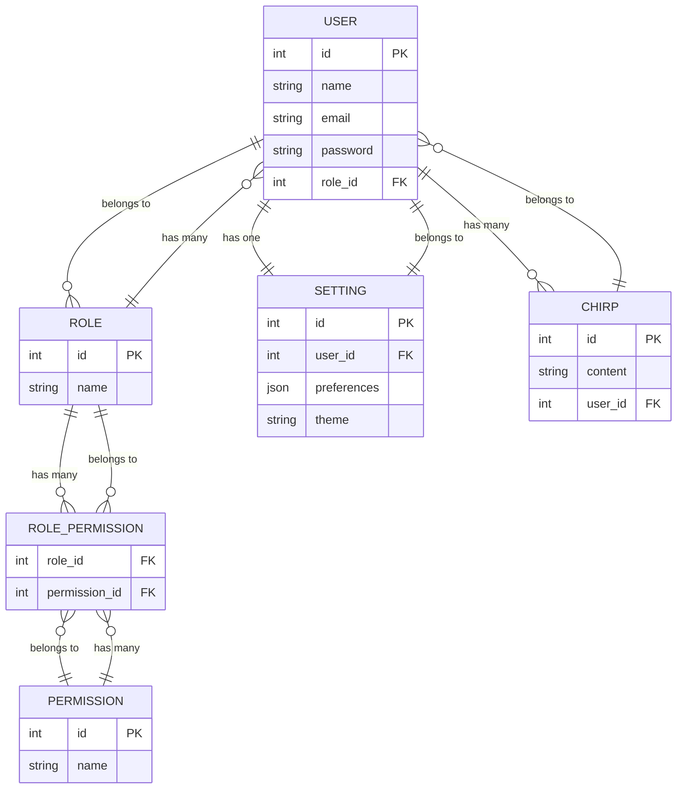

### a personal web app project

#### made with

*Laravel* | *Livewire* | *Alpine.js* | *Tailwind CSS* | *Vite* | *SQLite*

>explore the tech stack and used tools at my [info page](https://claymence.de/info)

## overview

### implemented
- user registration and login ([Laravel Breeze](https://laravel.com/docs/11.x/starter-kits#laravel-breeze))
- comments ("[Chirps](https://bootcamp.laravel.com/livewire/creating-chirps)")
- user and role administration
- light/dark theme

### work in progress
- browse images from the James Webb Space Telescope
- user settings

### planned / ideas
- e-mail verification
- e-mail notifications
- like / fav list JWST images
- vote for JWST showcase images
- testing lichess.org API
- playing chess against stockfish (chess engine)
- stockfish features for training/analyzing (blunder warnings, ..)
- playing chess against other users

## deployment

the [`deploy`](https://github.com/claymence/clay-laravel/tree/deploy) branch gets deployed at [claymence.de](https://claymence.de/) on push

[`.github\workflows\deploy.yml`](https://github.com/claymence/clay-laravel/blob/deploy/.github/workflows/deploy.yml)

## license

[MIT](https://github.com/claymence/clay-laravel?tab=MIT-1-ov-file#readme)

## more info & diagrams

*OOP*

*MVC*

### entity relationship diagram

