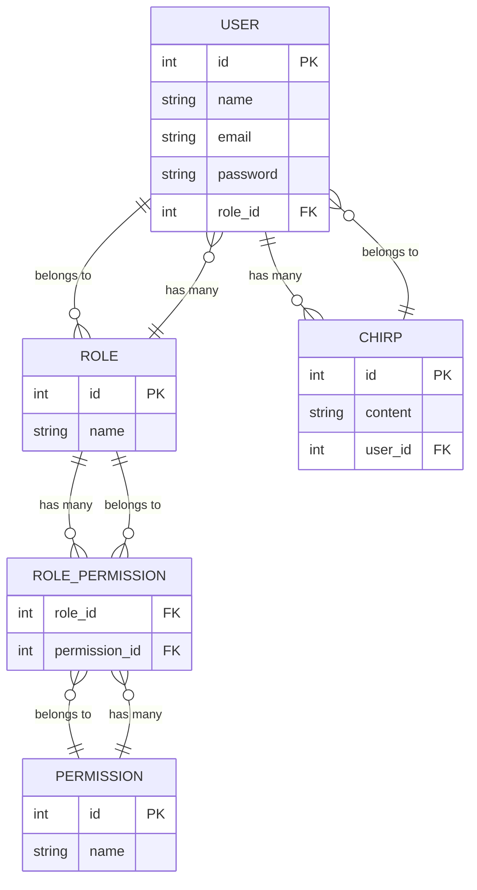

# clay-laravel
a web app made with laravel & livewire

## features
- user registration and login
- user and role administration
- "chirps" (microblog example from laravel tutorial)
- testing jwstapi.com API
- testing lichess.org API

## planned features
- e-mail verification
- e-mail notifications
- user settings
- browse images from JWST (James Webb Space Telescope) API
- like / vote for JWST showcase images
- playing chess against stockfish (chess engine)
- stockfish features for training/analyzing (blunder warnings, ..)
- playing chess against other users

## deployment
the `deploy` branch gets deployed at [claymence.de](https://claymence.de/) on push

[.github\workflows\deploy.yml](https://github.com/claymence/clay-laravel/blob/deploy/.github/workflows/deploy.yml)

## documentation

### entity relationship diagram

